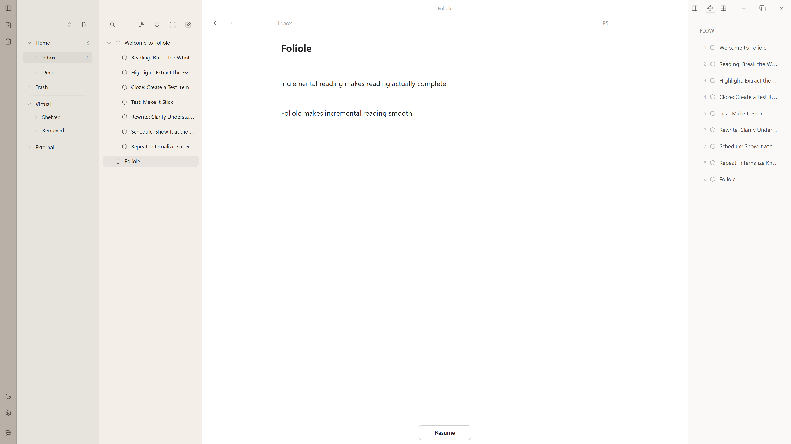

  
    <a href="https://github.com/campfirium/foliole/blob/dev/README.md">English</a> ·
    <a href="https://github.com/campfirium/foliole/blob/dev/docs/i18n/README.de.md">Deutsch</a> ·
    <a href="https://github.com/campfirium/foliole/blob/dev/docs/i18n/README.es.md">Español</a> ·
    <a href="https://github.com/campfirium/foliole/blob/dev/docs/i18n/README.fr.md">Français</a> ·
    <a href="https://github.com/campfirium/foliole/blob/dev/docs/i18n/README.it.md">Italiano</a> ·
    <a href="https://github.com/campfirium/foliole/blob/dev/docs/i18n/README.ja.md">日本語</a> ·
    <a href="https://github.com/campfirium/foliole/blob/dev/docs/i18n/README.ko.md">한국어</a> ·
    <a href="https://github.com/campfirium/foliole/blob/dev/docs/i18n/README.pl.md">Polski</a> ·
    <a href="https://github.com/campfirium/foliole/blob/dev/docs/i18n/README.pt.md">Português</a> ·
    <a href="https://github.com/campfirium/foliole/blob/dev/docs/i18n/README.ru.md">Русский</a> ·
    <a href="https://github.com/campfirium/foliole/blob/dev/docs/i18n/README.zh.md">简体中文</a> ·
    <a href="https://github.com/campfirium/foliole/blob/dev/docs/i18n/README.zh-Hant.md">繁體中文</a>
  

# Foliole

Spraw, aby czytanie naprawdę prowadziło do ukończenia. 
Przystępna aplikacja do czytania inkrementalnego.

Alpha dla Windows jest otwarta do testów. 
Alpha dla Androida jest planowana około lipca. 
Buildy alpha dla macOS i iOS są planowane około sierpnia.

  

## Demo

[Obejrzyj demo na YouTube](https://youtu.be/Cp-EaCVS-Ds)

## Zasady projektowe

### Open source

Kod jest open source. Każdy może przejrzeć implementację, zbudować Foliole ze źródeł albo wnieść własne usprawnienia.

  

### Otwarte dane

Foliole używa bazy SQLite i udostępnia lustrzaną wersję Markdown, dzięki czemu materiały łatwiej czytać, przenosić i wykorzystywać ponownie.

  

### Local first

Bez systemu kont. Bez centralnej synchronizacji w chmurze. Wszystkie dane pozostają na twoich osobistych urządzeniach; urządzenia synchronizują się przez sieć lokalną.

  

## Główne funkcje

### Natywne czytanie inkrementalne

Foliole opiera się na ideach czytania inkrementalnego Piotra Woźniaka i oferuje natywny przepływ pracy do wyodrębniania fragmentów, tworzenia cloze deletions oraz stopniowego dopracowywania materiałów bez opuszczania toku lektury.

  

### Zintegrowane planowanie FSRS

Foliole integruje FSRS (Free Spaced Repetition Scheduler), otwarty i wydajny algorytm planowania powtórek.

  

### Materiały do czytania w jednym miejscu

Foliole obsługuje materiały do czytania z różnych źródeł: pliki lokalne, dokumenty webowe, notatki zarządzane w Obsidianie oraz materiały eksportowane z Readwise Reader.

  

### Indeksowanie dokumentów zewnętrznych

Foliole indeksuje inne lokalne foldery na komputerze bez kopiowania lub przenoszenia oryginalnych plików, tworząc zewnętrzną bibliotekę dokumentów, którą można przeszukiwać, przeglądać i wykorzystywać na obsługiwanych klientach.

  

### Obsługa złożonych treści

Foliole obsługuje Markdown, PDF, EPUB, formuły LaTeX, bloki kodu i inne potrzeby związane z renderowaniem treści.

  

## Podziękowania

Szczególne podziękowania dla Piotra Woźniaka i Jarretta Ye. Bez SuperMemo, czytania inkrementalnego i FSRS Foliole by nie powstało.

Dziękujemy również następującym projektom i komponentom open source:

- better-sqlite3
- Capacitor
- CodeMirror 6
- Drizzle ORM
- Electron
- React
- SQLite
- TypeScript
- Vite
